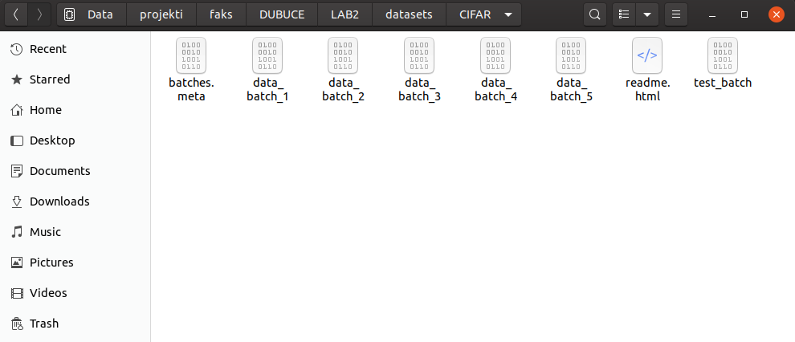

# Duboko učenje
## Druga laboratorijska vježba - Konvolucijski modeli

### Priprema

Ova vježba je specifična po tome što nema `datasets` direktorij. Ono što je potrebno prije pokretanja je sljedeće:

- napraviti `LAB2/datasets` direktorij
- napraviti `LAB2/datasets/CIFAR` direktorij
- preuzeti skup podataka s [ove poveznice](https://www.cs.toronto.edu/~kriz/cifar-10-python.tar.gz)
- raspakirati skup podataka dok se ne dođe do direktorija koji sadrži data_batch datoteke
- premjestiti te datoteke u `LAB2/datasets/CIFAR`

Vaš `LAB2/datasets/CIFAR` direktor sad bi trebao izgledati kao na slici:

Nakon toga slobodno možete pokrenuti vježbu. Ako želite ponovno trenirati neke od zadataka, ne zaboravite postaviti zastavice `tX_do_train` na `True`, gdje je X broj zadatka. Ove varijable nalaze se u sekciji **Postavke zadatka**.
